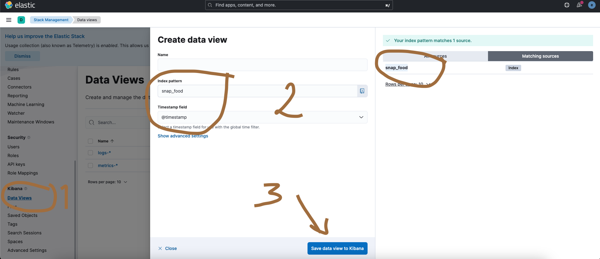
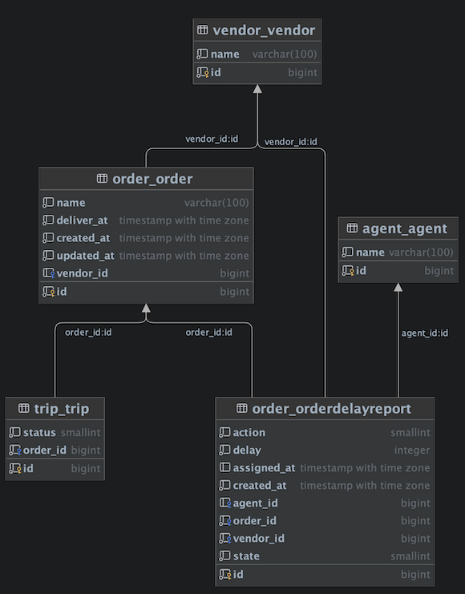

# SnappFood Delay Report Service
A web base service that handle delay report request at SnappFood company!


## Integrated Tools
- Python +v3.11
- Postgresql +v14
- Redis +v7
- Celery
- ELK v8.8.1
- RabbitMQ v3.12
- UWSGI
- Nginx
- Docker & Docker Compose
- Poetry (dependency management)
- Pre commit
- gitlab CICD
- Swagger

## Run via docker
Versions:
```shell
docker --version
# Docker version 20.10.21, build baeda1f
docker-compose --version
# Docker Compose version v2.13.0
```
### Docker network
First create a global network for docker project
```shell
docker network create sfdr_global || true
```
### SFDR Web App
To run service itself, execute the following command at teh root of the project (be sure u have installed both docker and `docker compose`):
```shell
docker compose up
```
Open [http://localhost/admin/](http://localhost/admin/) to access the admin panel with username=`admin` and password=`admin`.
<br>
To access the custom API documentation browse [](http://localhost/api/v1/) address.
<br>
To access the swagger browse [http://localhost/swagger/](http://localhost/swagger/)
<br>
To access the landing page browse [http://localhost/](http://localhost/)

### ELK
This is an unnecessary tools to monitor log and ... . After running `SFDR` service you can run RLK by running following command:
```shell
cd ELK  # enter ELK directory!
docker compose up setup  # Just once to setup pre-hooks, for the next time you can ignore this part.
docker compose up
```
After that you can access the kibana panel at [http://localhost:5601/app/management](http://localhost:5601/app/management)
then you need loging using username=`elastic` and password=`changeme` credential. To add the log data view (be sure you have at least one log, for example force app to raise 404 error by browse random api path):


## Run in development
First clone project and install dependencies:
```shell
git clone <repo_path> <project_root>
cd <project_root>
virtualenv -p python3.11  venv
source venv/bin/activate
pip install poetry
poetry install
```
Then run db in your local machine. Recommend using existence docker from project root dir:
```shell
cd <project_root>
docker compose up db
```
Then set the URI of db at the development environment variable at `environments/development.env` file. Then you can run app:
```shell
cd <project_root>
python manage.py migrate
python manage.py test
python manage.py init_user  # will create superuser username=admin  password=admin if not any user exists.
python manage.py runserver
```
Open `http://localhost:8000/admin/` at your browser and use following credential to enter admin panel:
```text
username=admin
password=admin
```
Have fun!

## ERD


## Swagger
If there is any instance of running project, you can access to online realtime swagger tool from [/swagger/](/swagger/) url path.
Also, you can access the offline swagger file from `./assets/swagger.yaml` path from root of project.

## Test
To run tests execute following command at the root of the project:
```shell
docker compose up db
```

## TL;DR
here is three endpoints that SnappFood interview order to implement :) just add base url to the following urls path!

Client report delay => [/api/v1/orders/<order_id>/report-delay/](/api/v1/orders/<order_id>/report-delay/)
<br>
Vendor assign a delay to himself => [/api/v1/orders/delay-assign/<vendor_id>](/api/v1/orders/delay-assign/<vendor_id>)
<br>
Vendor delays in current week => [/api/v1/orders/vendor-delay/](/api/v1/orders/vendor-delay/)
